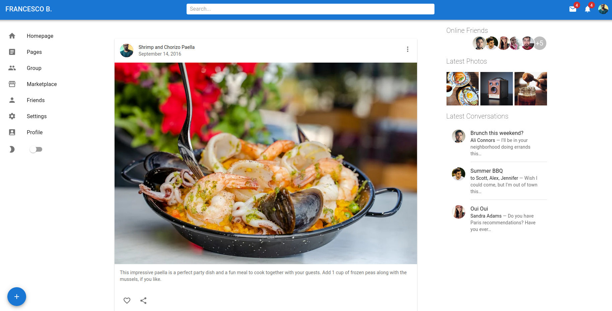
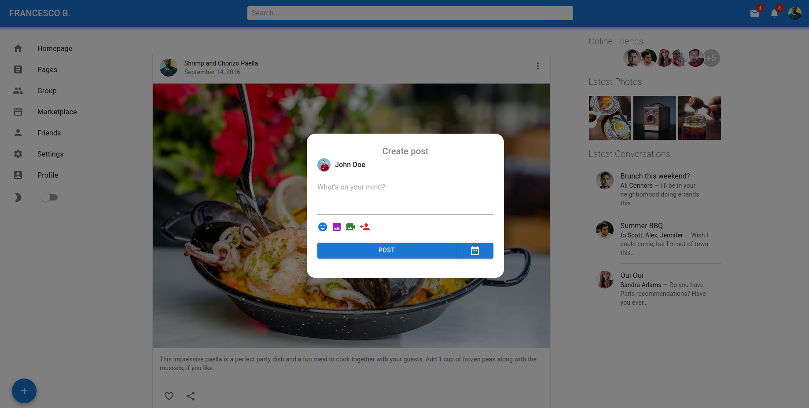

# React Typescript Material UI Social Network App Design
---
This app aims to be a sort of exercise for my react and material ui skills. 
It has been deployed on Netlify.

* ***[Live Demo](https://benevolent-baklava-d8f1dc.netlify.app/)***

## Screenshots of Features
<table>
    <tr>
        <tr>
            <th>Homepage and Responsive Layout</th>
            <th>Popup</th>
        </tr>
        <tr>
            <td valign="top">
                
            </td>
            <td valign="top">
                
            </td>
        </tr>
    </tr>
</table>
        
## Technology and Packages used:
- Framework/Library: **React v18 with create-react-app** and **Typescript v4.8** (latest versions nowadays)
- UI Kit: **Material UI v5** (latest nowadays)
- UI Icons: **Material Icons**
- Deployment: **Netlify**

## Development Packages and Tools used:
- Linting: **Eslint** (also auto-fix)
- Formatting: **Prettier**